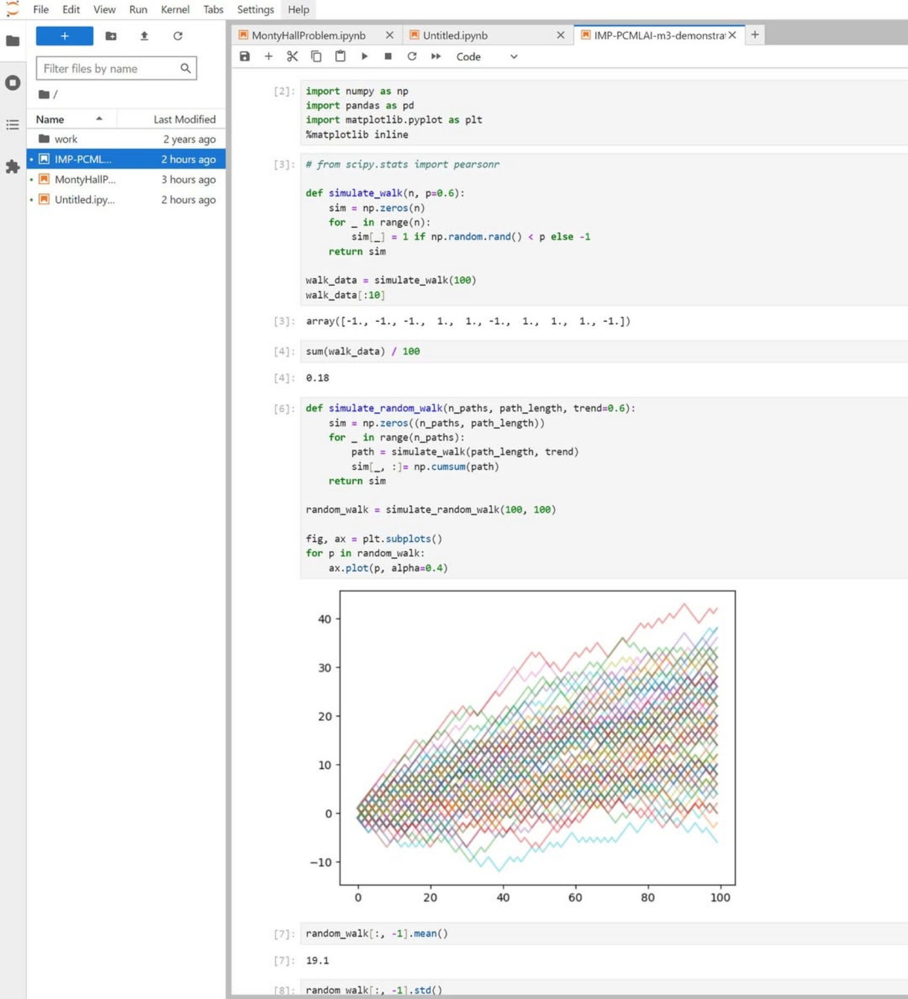

(AI/ML Jupyter Workbook)

I hold a joint honours degree in [Computer Science and Artificial Intelligence from the University of Sussex](https://www.sussex.ac.uk/cogs/about), although I graduated over 20 years ago, so the AI knowledge I was taught is no longer very uptodate!

I have therefore signed up for a 7 month certificate at [Imperial College London](https://www.imperial.co.uk) where I will be updating my knowledge on AI and ML, including learning about LLMs.

This is in order to position myself to work best in the intersection between Cyber Security, AI and software engineering.

