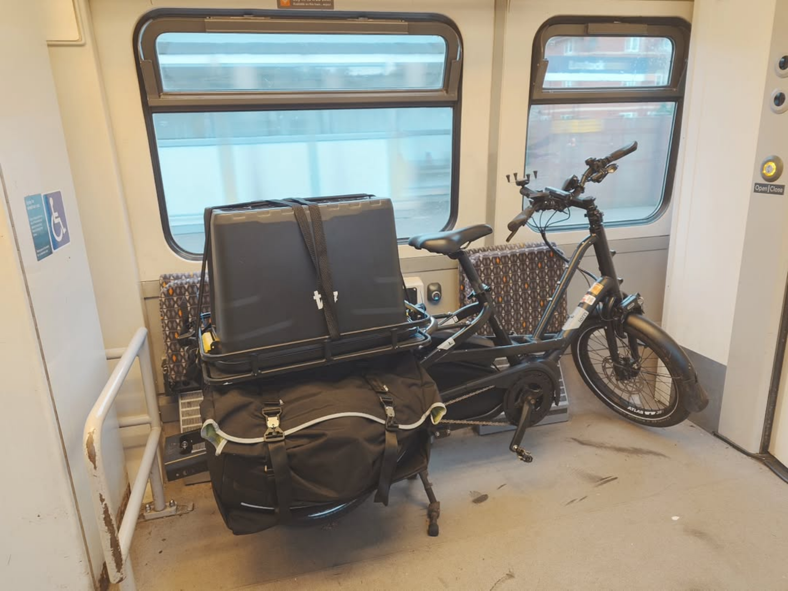
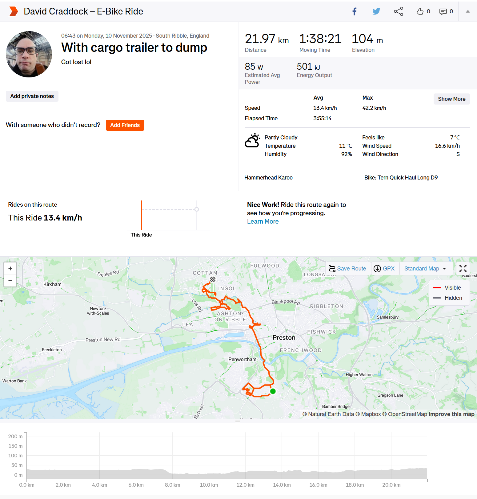
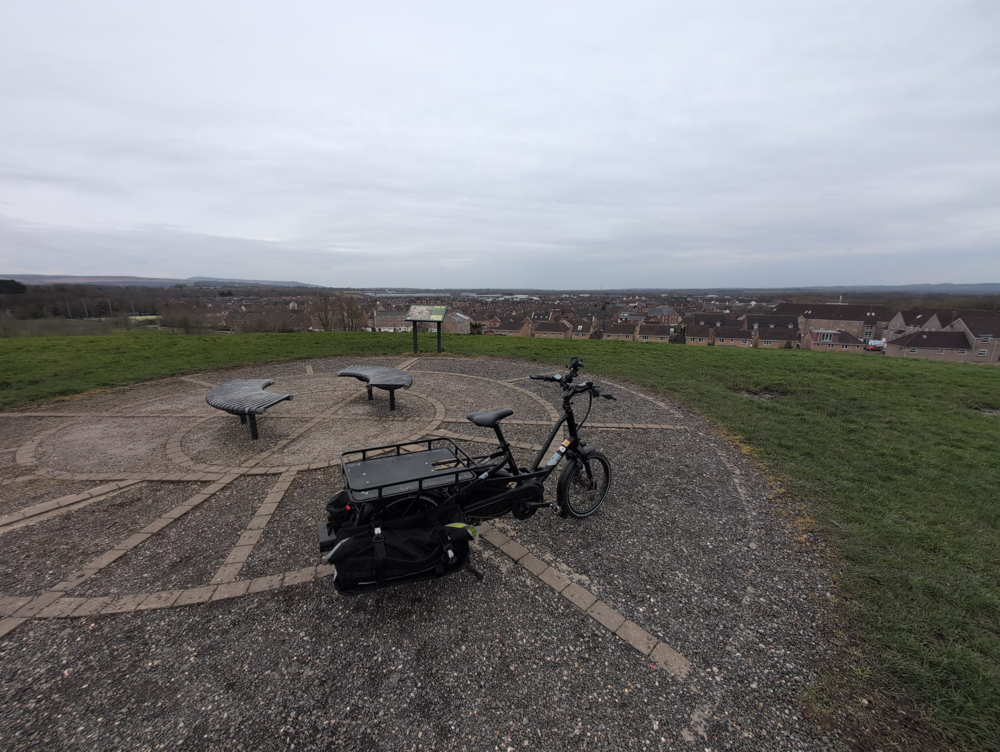
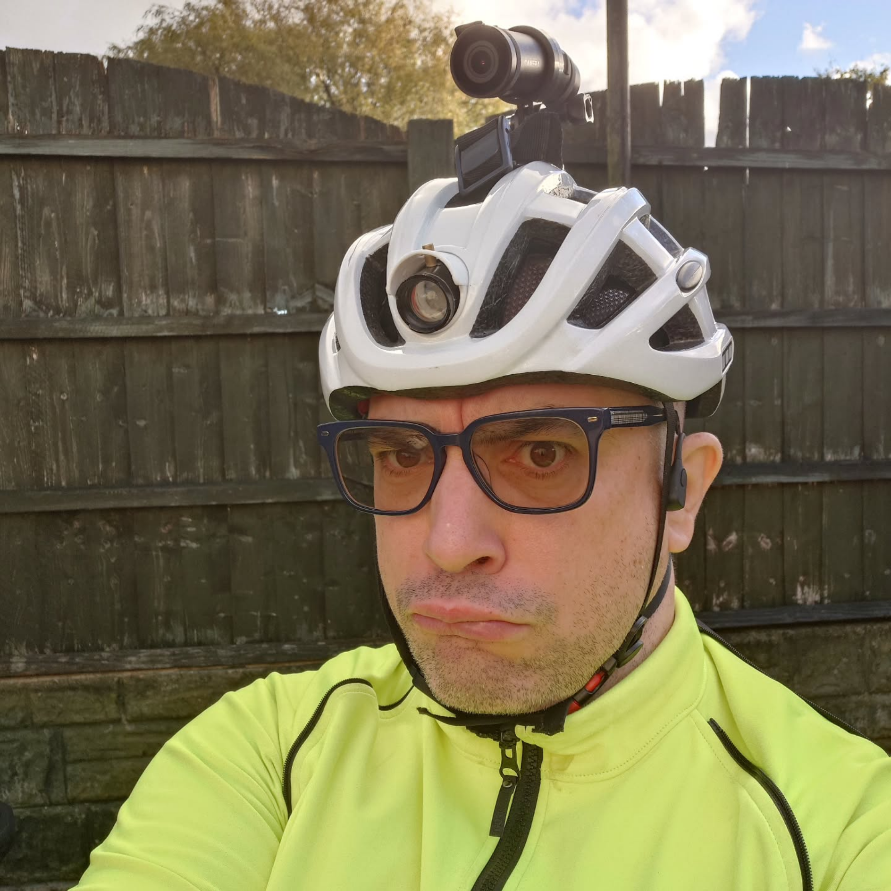

(Cargo bike and trailer)

I use this as a bike as a general-purpose car replacement, as well as volunteering and long-distance cycle challenges and trips. It has a maximum average power-assisted range of 60 miles on a single charge, assuming the lowest power-assist setting, up to 20 miles per charge for the highest power-assist setting.

I have configured it so that I can move large objects and cargo similar to a small car, and cycle and navigate safely and comfortably in all weathers, as well as use it as an exercise machine to keep fit and lose weight.

<iframe height='454' width='300' frameborder='0' allowtransparency='true' scrolling='no' src='https://www.strava.com/athletes/28235527/latest-rides/ab29994169b04111268e7a80e31a74d9630acd54'></iframe>

(Cargo bike on train!)

- Tern 2024 Quick Haul Long D9 Electric Cargo Bike (road legal, top electric-assisted speed 15mph, max. pull 415lbs)
- Hornit Electric bike horn
- CatEye AMPP 400 front light
- RAM grip quick release handlebar phone holder
- Bike bell
- Tern cargo hitch for bike trailers
- E-Cargo Bike Spare Tires
- Road Bike Winter Studded Tires which I keep on all year, just in case of icy weather
- Telescopic stool for breaks
- 4x small Vacuum thermos flasks for water/cold liquid
- Shimano B05S Disc Brake Pads and Spring Steel Backed Resin (MPQ25)
- Burgtec Penthouse MK5 Flat Steel Mountain bike Pedals Burgtec Black

## Electronic gear linked to cycle computer

- KAROO Hammerhead Cycle Computer
- ANT+ Polar H10 Heart Rate Monitor – ANT Plus, Bluetooth - Waterproof HR Sensor with Chest Strap
- ANT+ Garmin VARIKA RTL515 Back light and Rear bike radar
- SHOKZ OpenRun Bone Conduction Headphones, Open-Ear Bluetooth Sports Earphones with Mic, IP67 Waterproof Wireless Headset for Running and Workout, 8H Playtime, USB-C - Black, Sport headband
- ANT+ bike lights - Trek Ion Pro RT mounted on front bar/Flare RT mounted on rear of helmet

## Cargo/Hauling Gear

- 2x 51 litre Tern panniers with supportive Tern cargo deck frame, cable tied in
- Tern cargo tray
- Several Eurocrates for hauling cargo
- Lots of cargo ties for securing cargo while hauling
- Burley Bike Trailer - Flatbed Cargo Bike Trailer that can be folded up
- Tern extended stability cargo kickstand
- Burley Bike Trailer Cargo Bungee Net
- Bike trailer tires - Schwalbe Marathon Plus HS440 Rigid Tyre - 16 x 1.35, 35-349

(Taking some cardboard to the dump and getting lost along the way)

(On top of a hill somewhere in the South Ribble..)

## Emergency Gear

- Military compass and map of the Lancashire area
- Emergency compact bivvy bag
- Compact fibre towel
- Complete Cycle tools for changing a tire
- Puncture repair kit
- Spare inner tubes
- Penlight flashlight
- Spare Tern battery charger
- Swiss army knife
- Electric tire pump
- First aid kit
- Retro Nokia 4G Emergency phone and 2x Vodafone PAYG SIMs with £10 each on them

## Clothes and Gear

A good set of cycling clothes is essential for comfortable all-weather all-year cycling, even in an area with a relatively 'mild' climate such as the North West.

- Fingerless MTB gloves for warmer weather
- Luminous yellow winter cycling gloves
- 2x Goretex water-resistant high-vis cycle jackets
- Light backpack suitable for cycling
- Thermal 'long johns'
- Leg and arm warmers
- Rockbros rechargeable e-bike helmet with built-in (powerful) LED front light with up and down action so not to blind drivers, and rear light
- 3x Water Resistant cycling trousers

(A dangerous man.)

## Security

- TECHALOGIC DC-1. Dual Lens Helmet Camera for recording cycle incidents - records both the front and back
- Wearable body cam similar to that which is worn by bouncers and police officers
- 1x LiteLock X1 Angle-grinder Resistant Bike Locks (Diamond Motorbike Solid Secure Rated)
- 1x Hiplok DX (Gold Motorbike Solid Secure Rated / Diamond Bicycle Solid Secure Rated)
- CycleRegister security marking kit
- Immobilise security marking kit
- Tile tracker tags on as much as my regular equipment as possible.
- Insurance. Lots of insurance.

## Training / Certifications

- I have achieved 'Bikeability Level 3' as an adult, verified in December 2024, which is the most widely accepted form of road-ready cycle training and certification. [Link here](https://www.bikeability.org.uk/). Level 3 focuses in cycling safely in heavy traffic. This qualifies me to hire Electric Cargo Bikes.
- I have studied books and Driving Theory test material to learn how to navigate roads and read road signs, approximately to the level of a driving theory test, although I don't officially hold a driving licence.
- I have been DBS checked and have a clean record.

