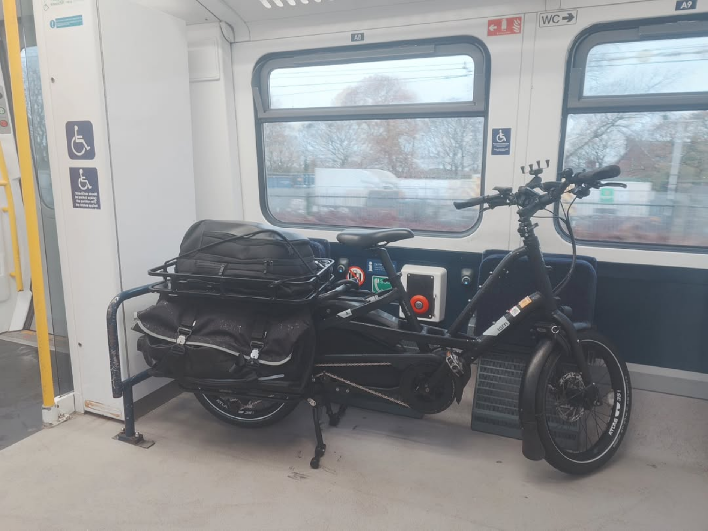

My wife and I use this as a bike for getting shopping and a general-purpose car replacement, as well as volunteering.

- Tern 2024 Quick Haul Long D9 Electric Cargo Bike (road legal, top electric-assisted speed 15mph, max. pull 415lbs)
- Hornit Electric bike horn
- CatEye AMPP 400 front light
- Wireless security tag for the key of the Tern immobilisation lock
- RAM grip quick release handlebar phone holder
- Bike bell
- Tern cargo hitch for bike trailers

## Electronic gear linked to cycle computer

- KAROO Hammerhead Cycle Computer
- Favero Assioma Pro Mx-1 power meter pedals
- Polar H10 Heart Rate Monitor – ANT Plus, Bluetooth - Waterproof HR Sensor with Chest Strap
- Garmin VARIKA RTL515 Back light and Rear bike radar
- SHOKZ OpenRun Bone Conduction Headphones, Open-Ear Bluetooth Sports Earphones with Mic, IP67 Waterproof Wireless Headset for Running and Workout, 8H Playtime, USB-C - Black, Sport headband

## Cargo/Hauling Gear

- 2x 51 litre Tern panniers with supportive Tern cargo deck frame
- Tern cargo tray
- Several Eurocrates for hauling cargo
- Lots of cargo ties for securing cargo while hauling
- Burley Bike Trailer - Flatbed Cargo Bike Trailer that can be folded up
- Tern extended stability cargo kickstand

## Emergency Gear (in lockable permanent Tern 'cash' box on bike)

- Military compass
- Emergency compact bivvy bag
- Compact fibre towel
- Complete Cycle tools for changing a tire
- Puncture repair kit
- Spare inner tube
- Penlight flashlight
- Spare Tern battery charger
- 5x USB Charger with 5x USB cables for simultaneously charging all portable electric bike accessories from a mains socket
- Swiss army knife

## Clothes and Gear

A good set of cycling clothes is essential for comfortable all-weather all-year cycling, even in an area with a relatively 'mild' climate such as Manchester.

- AERTIS gravel cycling shoes with cleats for power meter pedals
- Fingerless MTB gloves for warmer weather
- Wraparound anti-glare sun glasses for protection against surface dirt etc
- Wraparound cycle goggles with different visors
- Goretex water-resistant high-vis cycle jacket
- Light backpack suitable for cycling
- Thermal 'long johns'
- Rockbros Heated rechargable motorbike style gloves
- Luminous yellow winter cycling gloves
- Shorts with seat padding
- Leg and arm warmers
- Rockbros rechargable e-bike helmet with built-in (powerful) LED front light with up and down action so not to blind drivers, and rear light

## Security

- TECHALOGIC DC-1. Dual Lens Helmet Camera for recording cycle incidents - records both the front and back
- 1x LiteLock X1 Angle-grinder Resistant Bike Locks (Diamond Motorbike Solid Secure Rated)
- 1x Hiplok DX (Gold Motorbike Solid Secure Rated / Diamond Bicycle Solid Secure Rated)
- 1x Oxford 'Monster' chain and padlock (Gold Motorbike Solid Secure Rated / Diamond Bicycle Solid Secure Rated)
- 2x Sheffield Bike stands set in concrete in my garden
- 2x Oxford ground anchors set in concrete in my garden (Diamond Motorbike Solid Secure Rated)
- CycleRegister security marking kit
- Immobilise security marking kit
- Insurance. Lots of insurance.

## Training / Certifications

- I have achieved 'Bikeability Level 3' as an adult, verified in December 2024, which is the most widely accepted form of road-ready cycle training and certification. [Link here](https://www.bikeability.org.uk/). Level 3 focuses in cycling safely in heavy traffic. This qualifies me to hire Electric Cargo Bikes.
- I have studied books and Driving Theory test material to learn how to navigate roads and read road signs, approximately to the level of a driving theory test, although I don't officially hold a driving licence.
- I have been DBS checked and have a clean record.

