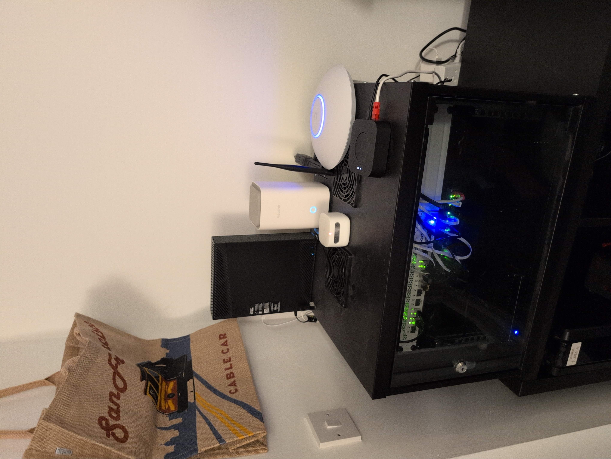
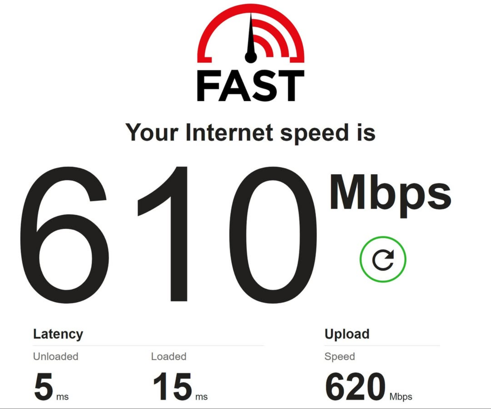

(Network cabinet)

It is my opinion that every security professional 'worth their salt' should have a homelab.

Therefore, I have built a 10Gb/second network in my home in a network cabinet. It has taught me a lot of networking, IT and cyber security skills. A network diagram can be provided under certain circumstances, e.g. job interviews.

Here are the details:

### Security and Design goals:

* No static IP.
* Minimise exfiltration of personal data assets to big tech companies to train their own AI systems at my expense - try and make sure no sensitive data leaves the network.
* No unpatched devices allowed on network, enforced by automated patching.
* No out of security updates period devices allowed on the network, enforced by VLAN segregation, guest network, and MAC filtering.
* Zero ports open to the internet.
* Software-defined VPN remote access to the network only.
* Suricata IDS collecting data continually with a large ruleset to flag any suspicious traffic.
* Wazuh SIEM monitoring with agents on all possible network connected clients.
* Two internal DNS servers on the LAN forwarding any requests to NextDNS servers via DNS over TLS.. so that the ISP hardware never notices any unencrypted DNS requests which it could snoop on.
* Anonymising VPN connections to exit nodes in other countries for private traffic.
* Automated weekly security updates using bash scripting to upgrade all Mikrotik devices, Opnsense, Debian server and all Windows 11 PCs (via remote SSH access and Powershell scripts).
* Automated weekly backups of all crucial files (both system and data) on all devices, including Mikrotik, Windows PC, Debian server, Opnsense box.
* Advertising, analytics, malware and tracker blocking on the DNS level for all the network.
* Hardened Mikrotik, PC, mobile devices, and Linux server configurations, with minimal ports listening, and firewalls correctly enabled, in a ‘zero trust’ assumptional design.
* SIEM real-time alerting for threat and vulnerability discovery, with regularly updated CVE scanning on agents.
* Hardened Windows 11 setup, with in-built AI features removed with W11Debloat, web caches automatically regularly shredded using Bleechbit, and Wazuh clients on all Windows PCs.

### Hardware:

* I use a Mikrotik router and Mikrotik switch to route at 10Gb/sec speeds, and 3x Ubiquiti wifi 7 APs in mesh mode.
* I have a Protecli custom network interface fanless PC that runs Opnsense with Suricata IDS that monitors all traffic to and from the internet on my network. - Protecli - VP2440 - 2x 10GbE, 2x 2.5G Port Intel® N150 - Kingston DDR5-5600 SO-DIMM Memory Module - 32GB - 1TB Kingston NVMe NV3-1000G
* I have a ZigBee to IP adaptor which allows me to interface the HomeAssistant setup with low cost ZigBee buttons etc.
* A 6 bay 48TB NAS Linux server that runs Debian, and hosts around 20 services, mostly using docker compose - TERRAMASTER F6-424 Max NAS Storage - 6Bay Core i5 1235U 10-Cores 12-Threads, 32GB DDR5 RAM Dual 10Gb/sec CAT UTP ethernet
* A couple of Windows 11 PCs which I use day-to-day.
* E-readers and tablets linked to my calibre libraries.
* Reolink security cameras linked to HomeAssistant with zero traffic being sent external to the network.
* Gaming PC with >10TB of retro games stored remotely on the Linux server, and accessible on the gaming PC.
* Mobile phone running GrapheneOS.
* Many IoT and smart home devices.
* 4K HDR 43" Sony TV with 5.1 Dolby Surround Sound system, able to stream films/TV from the Plex server.

(Gaming PC wifi 7 speed)

### Network services run:

* Plex Media Server (accessible remotely), Tautalini and Kometa services.
* Full arrserver suite (except Whisparr).
* A simple web server running an intranet home page, with automated inventories generated of all types of stored media, including file counts, data used and paths.
* Checkrr, a media file checker and fixer running on all media files daily.
* 2x Calibre-web libraries for eBooks and e-comics, and associated metadata correcting and cataloguing helpers. These are accessible wirelessly by my e-reader devices.
* Several Samba mounts for ingress of different types of content (audio, video, ebooks etc) that automatically get imported to the file server libraries by scripts.
* Samba mount for a huge collection of retro gaming and arcade ROMs that are playable remotely by my gaming PC.
* NextDNS for DNS-level blocking and anonymous and secure DNS lookups.
* HomeAssistant that controls smart home IoT devices, with a IP to ZigBee adaptor.
* Unbound DNS server forwarding all DNS requests recieved on port 53 of the Opnsense server to NextDNS servers using DNS over SSL.
* NextDNS server on the Linux server forwarding all DNS requests recieved on port 53 of the Linux server to NextDNS servers using DNS over SSL.
* Wazuh SIEM accessible from the LAN.
* Ubiquiti Unifi Controller.

### Services run on the server:

* Thor APT AV professional malware scanner running fully automated weekly runs.
* Weekly fully automated Borg backup runs.
* Weekly fully automated Rclone syncs of the backup runs to an Amazon Deep Glacier S3 bucket.

