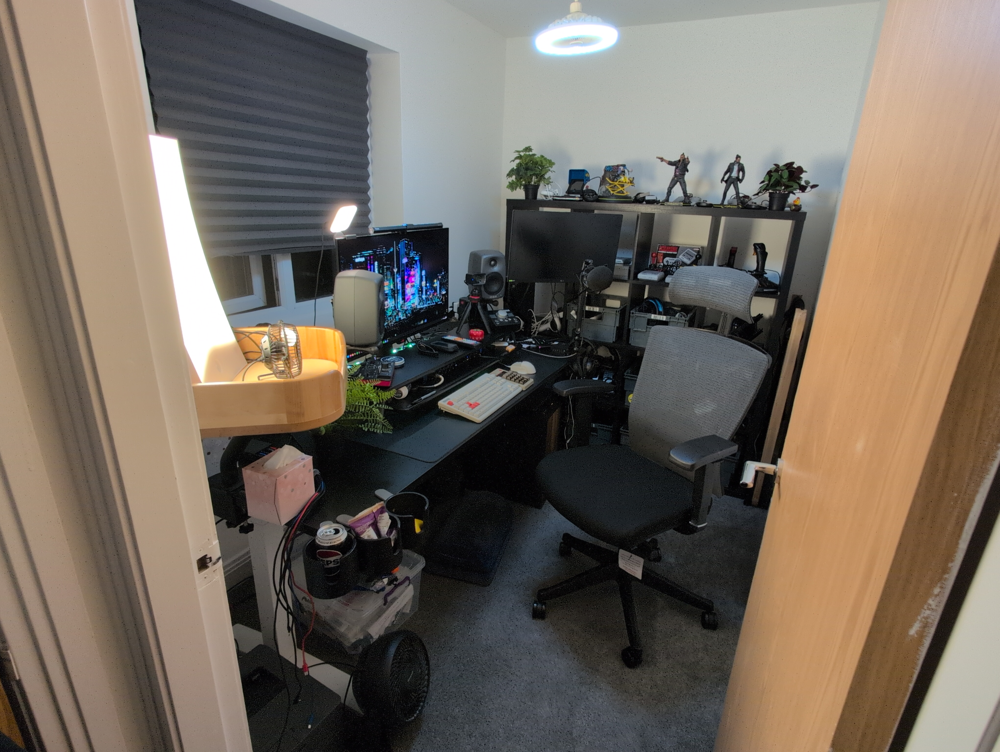
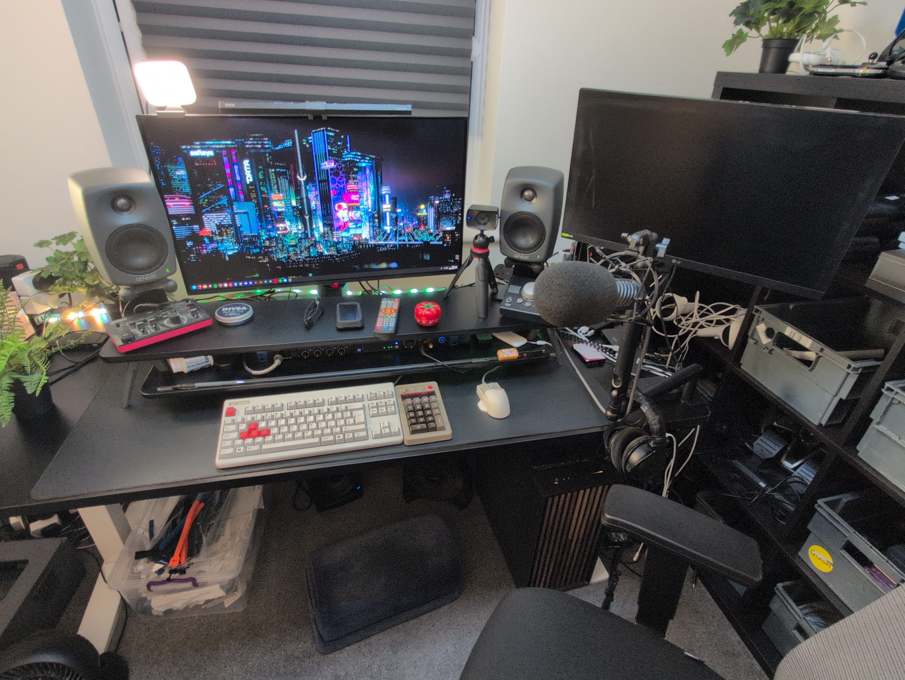
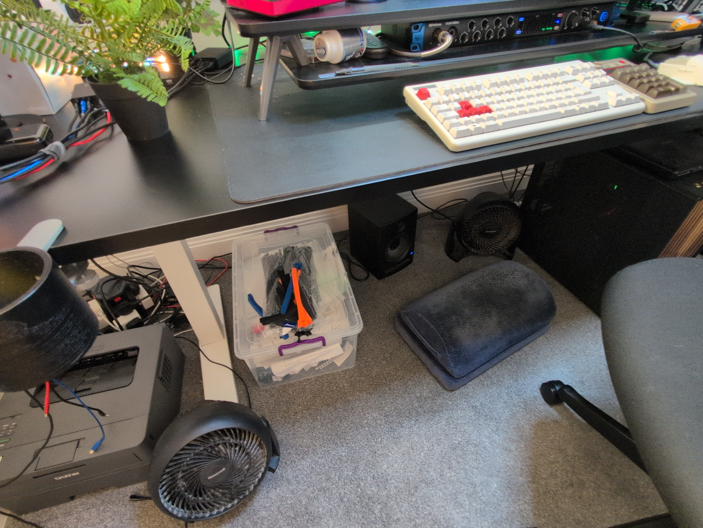
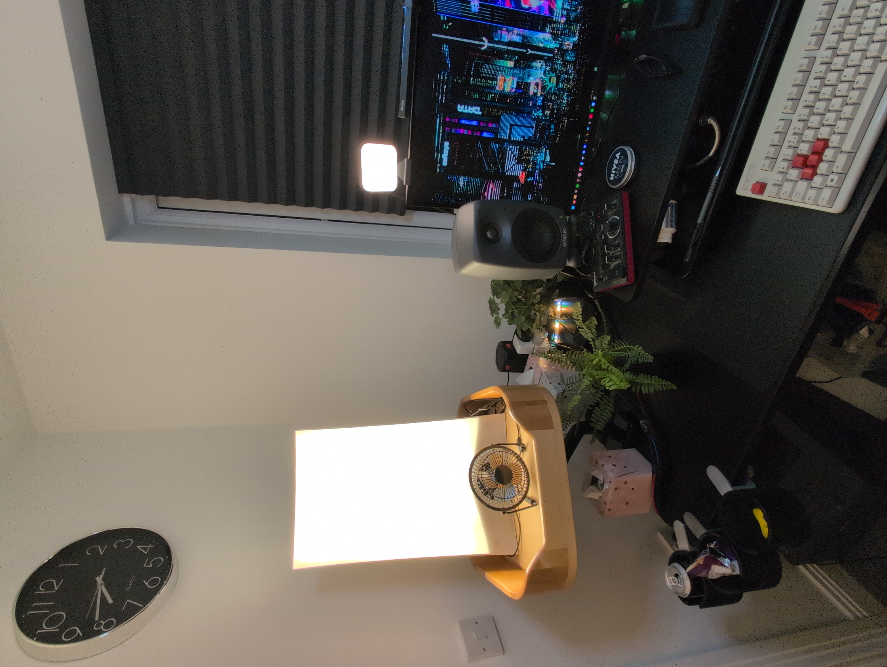
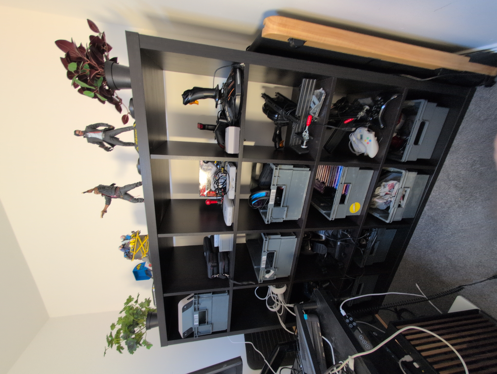

(Full Room View)

(Desk worktop)

(Below the desk)

(Left of the desk)

(The gaming/morale shelves)

This is my work from home setup. I work from home every work day. I use the following equipment:

## 'Studio.local' - my main PC for WFH and gaming

I run Windows 11 on this, and use Ubuntu Linux WSL2 with a Kali Linux virtual machine also.

- Ryzen 7 9800X 3D CPU
- GIGABYTE B850 AORUS ELITE WIFI7 Motherboard with 2.5Gbits/sec internet and on-board Wifi7
- Be quiet! Straight Power 12 1000W power supply, ATX 3.0, 80 PLUS Platinum
- Cooler Master MasterAir MA824 Stealth CPU Air Cooler
- Samsung 990 PRO NVMe M.2 SSD, 4 TB, PCIe 4.0, 7,450 MB/s read, 6,900 MB/s write, Internal SSD
- Fractal Design North XL Charcoal Black Mesh
- G.Skill Trident Z5 Neo EXPO RGB 64GB (2x32GB) DDR5 PC5-48000C30 6000MHz
- ASUS GeForce RTX 4070 12G DUAL EVO OC Gaming Graphics Card - 2550MHz Boost Clock, GDDR6X, PCIe Gen 4, DLSS 3, HDMI 2.1a, 3 x DisplayPort 1.4a (Supports 4K & 8K HDR) * 12th Gen i7 CPU
- 1x 1TB SSD that I use as a system drive for legacy reasons

### Keyboard and Mouse

- Topre Realforce UK without numpad
- 8BitDo Retro 18 Mechanical Numpad, Supports Calculator Mode, Bluetooth/2.4G/Wired Numpad for Windows and Android - C64 Edition
- LOFREE TOUCH PBT Wireless Mouse with USB receiver, Bluetooth, Wired Connection, Rechargeable, 4000 DPI with OLED Screen Compatible with glass surface for Mac Windows PC Notebook/Block Retro White Gray

### Technical Equipment shared between the laptops of the companies I work for, and my own workstation

- ASUS ROG Swift OLED PG32UCDM gaming monitor ― 32-inch 4K QD-OLED panel, 240Hz, 0.03ms (GTG), G-SYNC compatible, custom heatsink, graphene film, uniform brightness, 99% DCI-P3, True 10-bit, 90 W Type-C
- 29 inch 'Tate Mode' portrait mode LCD VA 144hz refresh gaming monitor with Gsync
- 2x Genelec 8020 DPM speakers
- Logi USB headset with noise cancelling microphone
- Logitech Key light for web cam calls
- Elegato Facecam 1080p HDR Digital SLR Webcam
- R0de Procaster mic with boom, roll cage and muffler
- Presonus 1824i USB-c sound interface that is connected to the PC.

### Ergonomic Equipment

- Flexispot E7Pro Motorised Standing Desk
- Flexispot BS14 ergonomic chair with headrest
- Flexispot standing desk mat
- Wooden rocker balance board
- 360 style balance board
- Fenge Dual Monitor Riser and Storage
- FIFINE Microphone Arm Stand
- Quntis Monitor Light bar with RGB Backlight, 40cm Computer Monitor Lamp with Dimmer and Color Temperature

### Other Equipment

- Brother Black and White Laser Printer
- Flatbed scanner
- Pomodoro timer
