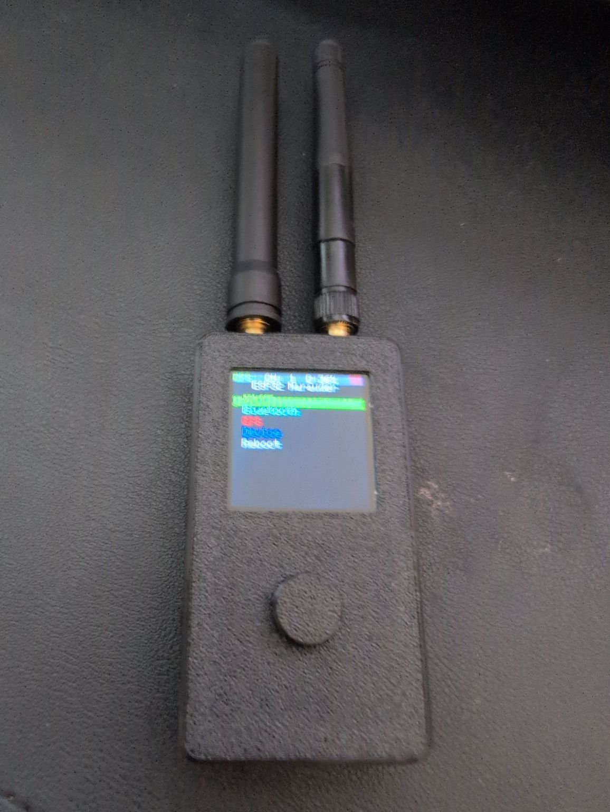

To send a secure message to me:
<a href="https://signal.me/#eu/wMBAjMYf1pZVvDvwtmIogYVIWfNITazJN83decO5mcFaXrilXldJgYaqz9OXK0my">Use my signal username: granddesigns.92</a>



* I am currently familiarising myself with tools to implement cyber security solutions.

* This is in preparation for my research project as part of the [MSc Cyber Security](https://www.london.ac.uk/study/courses/postgraduate/msc-cyber-security) masters I'm taking from the University of London via distance learning.

* This research is strictly for informational purposes and I don't do anything criminal with it.

* I realise some of this information may be seen as 'over-sharing' and is a security risk in itself, but I believe that the benefits of sharing this information outweigh the risks, and that there is no 'security via obscurity'.

* Random party fact: I got an anonymous article published in the [Autumn 2010 edition of 2600 magazine](https://davidcraddock.net/2600.pdf), called 'Editing the Brand' - about brand forgery and subverting advertising.

## Red Team

### Wardriving and Wifi cracking

I have two Raspberry Pi Zeros configured headless with [pwnagotchi](https://pwnagotchi.ai/) to automatically capture wifi handshakes hashes to crack later.

I have an <a href="https://www.amazon.co.uk/ALFA-AWUS036ACHM-802-11ac-Range-Adapter/dp/B08SJBV1N3">ALFA</a> AC600 long range wireless adaptor with a directional antenna that I've used to try and harvest PKID packets from my local area in order to capture their password hash and audit their wireless security. For this project, I used Kali Linux and the script <a href="https://github.com/ParrotSec/airgeddon">airgeddon</a> and its tools.

I have used the password cracker hashmat locally with GPU acceleration on both Windows and Linux, although I currently use a distributed volunteer-based password cracking tool to audit passwords.

My analysis is that currently, by far, the best way to hack a network using wireless is use DEAUTH attacks combined with an Evil Twin Wifi hotspot to capture credentials. Unfortunately this is very illegal so I have not really used this method in practice!

High gain directional antennas with DEAUTH floods can also be used to take out wireless devices such as wireless smart home security cameras etc on a temporary basis.

### Password cracking

I have a [hashmat](https://hashcat.net/hashcat/) password cracker setup that utilises my PC with an Nvidea gaming graphics card. I can use this to attempt to crack wifi handshake hashes with a dictionary attack.

### Mar-X-Auder Mini ESP2

I like my Mar-X-Auder Mini ESP2 wireless hacking device - [£40 from AliExpress](https://www.aliexpress.com/item/1005010257257525.html). Open-source and already has most of the cool functionality of Flipper Zero.

### RFID and Smart Card Security

I have a [Proxmark3](https://en.wikipedia.org/wiki/Proxmark3) setup which I'm using to learn about RFIDs, smart card security and smart card cloning. I am still getting used to using this, there is a lot to learn!

### Kali Nethunter

I am planning on installing [Kali Nethunter](https://www.kali.org/docs/nethunter/) on my old Sony Xperia 1 III. This will allow me to do more security research on the go.

## Blue Team

### Self-hosting Security

I am moving to self-host as much of my digital content as possible, to force myself how to learn to secure things properly.

* As a web server I'm currently using 'SWAG' - [Secure Web Application Gateway](https://hub.docker.com/r/linuxserver/swag), which includes fail2ban, ngnix, certbot and letsencrypt in a secure configuration. In combination with building all my externally facing websites using a static site generator such as [Hugo](https://gohugo.io/), I keep the attack surface to a minimum.
* I use [Firefox Relay](https://relay.firefox.com/accounts/profile/) to provide an anonymous email alias for countering spam.
* I use [CloudFlare](https://www.cloudflare.com) heavily for DDOS protection and a lot of other security features for my self-hosted domains, including DNSSEC for all domains.
* I use [Thor AV](https://www.nextron-systems.com/thor/) on the Linux sever to scan weekly the entire server.
* I use [Geoblocker](https://github.com/friendly-bits/geoblocker-bash) to block all Russian and Chinese IP addresses from accessing my server, this seriously cuts down on botnets.
* I use a number of automated rootkit detectors and scanners to keep an eye on everything.
* I use an automated scheduled job on my server to upgrade and security patch the server, and all my Linux and Windows machines, and my routers and switches, to defend against 0-day exploits.
* All my Windows machines run Windows 11, are set to automatically download and update in the background, have all the in-built security features turned on, and have Windows Defender enabled.
* I use [endlessSSH](https://github.com/skeeto/endlessh) to waste computer time of malicious bots that automatically attempt to connect to port 22 of my server.
* I use [ZeroTier](https://www.zerotier.com/) to implement a secure and simple software-defined VPN without exposing any open ports to the world.
* I have my own [Google Workspace](https://workspace.google.com) account and use Google Workspace's advanced security features to secure my email and authentication.
* I use [NextDNS](https://nextdns.io/) to provide secure DNS resolution for all my devices.
* I use Mikrotik routers and switches and have hardened the security on them through extensive familiarisation and research.

### Personal Security

* I own a pair of FIDO compliant physical security keys, use phone 2FA and [LastPass](https://www.lastpass.com/) with random unique passwords on all sites to ensure authentication security, in combination with my Google Workspace.
* I keep my mobile phone locked and constantly up to date with the latest security patches at all times.
* I use [Mozilla VPN](https://www.mozilla.org/en-GB/products/vpn/) and Mozilla Firefox with security and ad-blocking plugins to ensure my browsing is private and secure.

### Firefox Security

I have gone through the ridiculously excellent 11th Edition of <a href="https://www.goodreads.com/book/show/19824756-open-source-intelligence-techniques">OSINT - Open Source Intelligence Techniques: Resources for Searching and Analysing Information</a>, and built a Firefox configuration around Michaels suggestions. This allows me to leverage OSINT tools while keeping me secure and locking down my internet privacy as much as possible.

### Wireless Network Security

I use a separate GUEST wifi network which doesn't have access to any other parts of the network, ditto a IOT wifi network to isolate the IOT devices from any mischief. I regularly pentest my own wireless network as a part of my security research.

### CTF/Hack the Box

I have been working with the university of London Worldwide to start up a 'Cyber Security' society with the hope that we can compete with other teams in Hack the Box/CTF competitions. I have been appointed Vice President of this society and we are looking to implement a programme of security events and competitions.

[Our CTF writeups and society homepage is here](https://cybersec-soc-ulgc.github.io/)

### CCTV and Security Cameras

I am building an open-source CCTV system using cheap old Axis cameras that are out of their supported life. Currently I have tried using Shinobi CCTV but I'm not happy with it, and am looking to move to a different system such as ZoneMinder.

