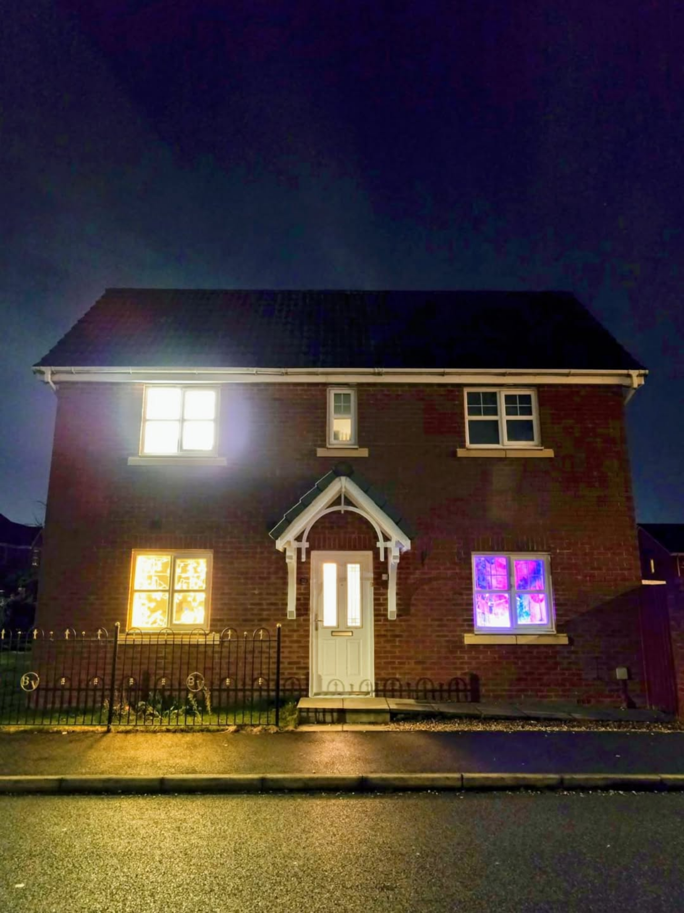
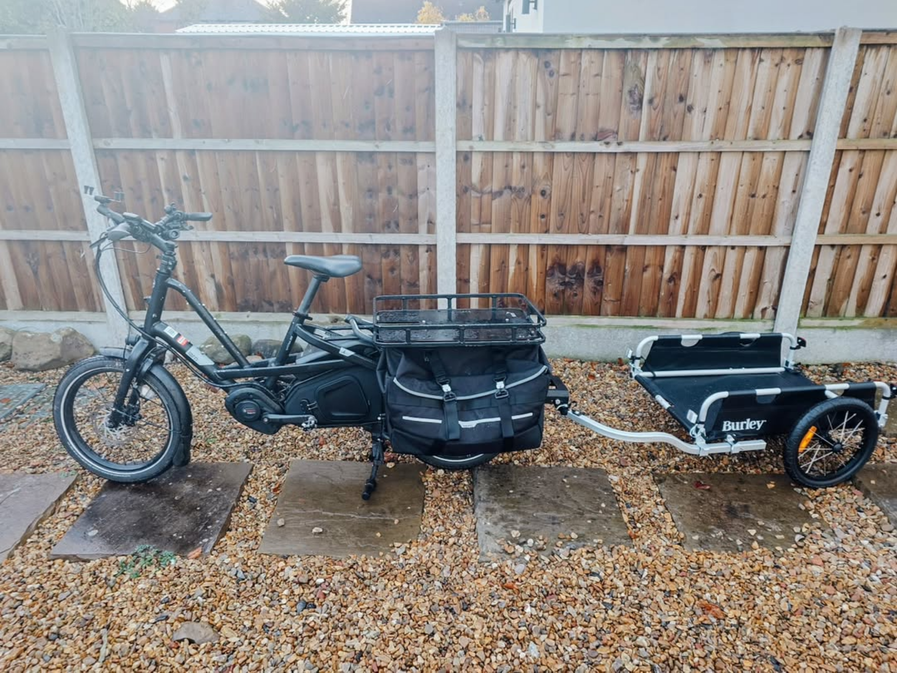

The last retrospective I wrote was in [August of this year](https://wordswords.github.io/posts/mid-2025-retrospective/). At that time, we were still in the old house in Withington desperately waiting for it to sell, and all our possessions were in storage crates. Everything was very chaotic.

Fast-forward a few months, and I'm pleased to report that things have settled down.

- The house finally sold, we moved out (thanks a lot to my friends I made from the Retro Gaming Meetup, who helped us move!), and we moved all our stuff into a storage unit in Bolton, while we moved with Betty our cat into a pet-friendly [AirBnB](https://www.airbnb.co.uk).
- We bounced between 3 AirBnB places, while looking for a long-term rental. For some reason, finding a long-term rental, even on the outskirts of Manchester, even with the ability to put down 6 months rent in advance, was difficult!
- The advantage of bouncing between AirBnB places is that we quickly found out that we did not want to move to Bolton after all, which was our initially intended destination. Instead, we found that the Preston and South Ribble areas were MUCH better suited to what we wanted.
- At the start of December we finally moved in to a long-term rental in Buckshaw Village, Chorley. We now live in a rented new-build house with 3 bathrooms (!) and a train station 8 minutes walk away that runs half-hourly trains to Manchester.
- During this time I have continued to study for my Master's degree in Cyber Security at [Royal Holloway, University of London](https://www.royalholloway.ac.uk/research-and-education/departments-and-schools/information-security/), via distance learning. I have been taking on additional extracurricular activities for the [UOLWW Cyber Security Student Society](https://cybersec-soc-ulgc.github.io/), where I have been appointed vice-president. I have also been upskilling on GenAI and doing my best to follow the absurdly rapid rate of progress in research around AI and deep learning.
- In December, I realised that I needed to have a more formal qualification in AI/ML/GenAI because it is becoming so 'key' to modern technology. I signed up for a 7-month professional certificated at [Imperial College London](https://www.imperial.ac.uk/), again distance learning, that I will study alongside my masters degree and the other upskilling I am doing.
- I have registered my new business at Companies House, ["Straylight Research Ltd"](https://straylightresearch.ai). At the moment I have not done any work to progress it, but it will eventually be an 'umbrella' for self-employed business activities I end up doing. I have done quite a bit of contract work in the past but not had a formal company to place it under, which has caused problems. I also intend to build a SaaS product around Cyber Security and GenAI to try and build up some passive income.
- Additionally, we have now moved in fully to the new place, and we have a whole new set of IKEA furniture installed thanks to Conny's flat-pack skills, and a full network cabinet, and a gigabit broadband connection, and all the things you miss while technically 'homeless' and bouncing around AirBnBs.
- I have upgraded and repaired my e-bike setup, so now it is much more of what I envisaged as a 'car replacement' and I use it heavily for exercise and just general errands.

- Conny has been interviewing for jobs, hopefully she will find something part-time in the new year, which will give her some independence and her own income. The long term plan is for her to start studying a Modern Languages' university degree in September - we need to apply and sort out student loans and all that stuff over the next few months.
- I have had to put the retro gaming meet-ups on hold while we have been moving, but I hope to start the meetings up again in the new year. We have a possibility of hosting them in a dedicated space which is very exciting, more on that to be revealed later.

So basically, we've both done a ton over the last few months and are very busy!

We are definitely in a much better place than before though, the new house is a huge upgrade, and our life is so much better than before! So nothing bad at all to report for once!
