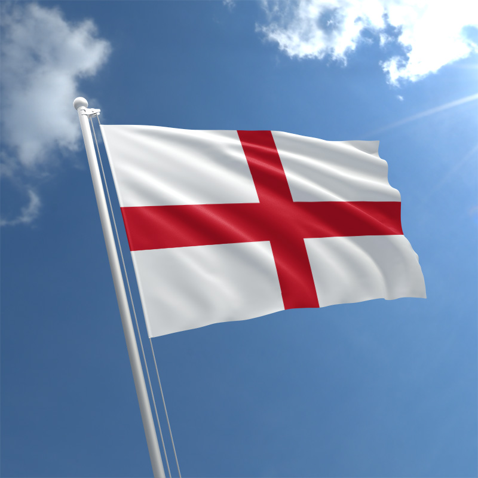

Have just finished the most recent module exams for my MSc Cyber Security degree at University of London, Royal Holloway.

This means that I have now attempted (and I hope - passed) around 50% of the degree content, not including the final project, since I started the degree in April 2025.

Previously I was averaging a distinction result, I am not convinced those two last exams will result in me maintaining the distinction average, but we will see!

This gives me more time to study for my PG Cert in AI/Machine Learning at Imperial College.

I 'remitted' my Imperial College cert to this study window, as I was struggling with the initial study window, with everything going on.

Now I need to focus 100% on learning the required maths to pass the PG Cert.

I have bought tons of math books which will help, I just need to sit down and read them.

After the Imperial College cert finishes, I aim to be studying for my OSCP+ - that is the last objective on my list, and hopefully take the OSCP+ exam by November.

A lot could disrupt all this, not least because I have to find some way of meeting our living costs, as my savings for this study sabbatical have almost entirely ran out.

But I am somewhat hopeful right now that everything will be OK.

