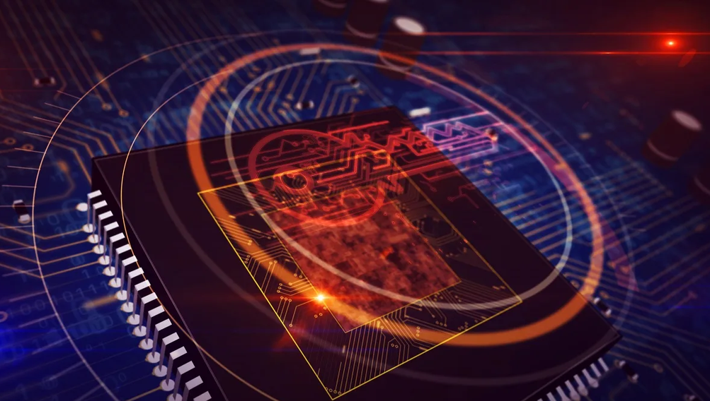

It has been interesting learning about FHE - [Fully Homomorphic Encryption](https://en.wikipedia.org/wiki/Homomorphic_encryption) and MPC - Secure [Multi-Party Computation](https://en.wikipedia.org/wiki/Secure_multi-party_computation) in my recent studies with [Royal Holloway, University of London](https://www.royalholloway.ac.uk/research-and-education/subjects/information-security/).

Honestly, I think these advances are very exciting. Some people think that cryptography is too academic or inscrutable, but the reality is that it has had the biggest affect on our digital lives.

Without cryptography, Bitcoin, HTTPS, secure messaging, VPNs, online banking, online payments in general, WIFI, mobile phones.. simply would not be able to exist because they would be too insecure to implement.

So really, the foundations of what we call 'the internet' depend on cryptography and would not be able to exist without it!

FHE and MPC mean that, someday, it may be possible to ensure 100% private data connections, and not just in terms of data we send to servers such as AWS services to process, but in terms of 100% private use of LLMs and GenAI!

This is conceivably possible only because of cryptography.
