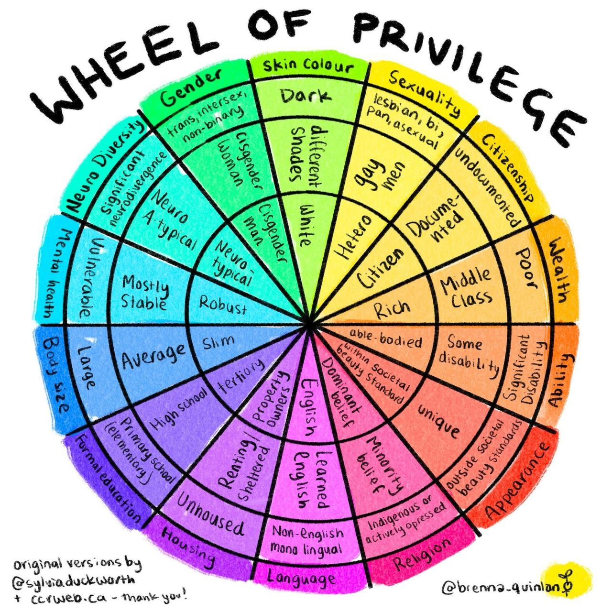

I found this diagram very interesting and useful for explaining multiple levels of privilege in society, and also explaining how some people can be very privileged in some areas and very unprivileged in others.

There are a lot of minority and oppressed groups that actively fight against each other and condemn each others 'weaknesses' - and this should show that this is really NOT a good idea, and that we should all understand that even though we might be actively disabled or unprivileged in some areas, we all are more privileged in some areas compared to others.

