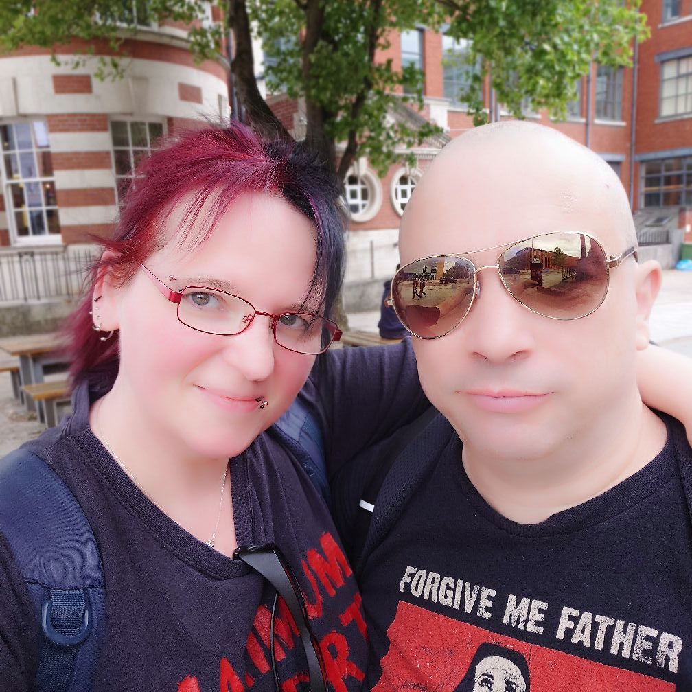

We absolutely LOVE where we have moved to, very near Chorley, in the Lancashire countryside.

The problem is, we are not like our neighbours. I regularly wear light-adaptive designer glasses, and a huge elaborate leather 'cyberpunk style' jacket. My wife regularly wears J-pop hoodies, wears sunglasses when she goes out as she has light sensitivity, is German, and has a lot of piercings. We are in our 40s.

Our neighbourhood seems to be populated by mostly people who seem more or less the same. It is middle class, and full of expensive SUVs on every drive. They even mostly have the same colour SUVs!

That colour is grey.

The kids mostly clad themselves in puffer jackets and 'urban casual' clothing. They honestly look all the same, almost like a criminal photofit ID lineup.

But.. it is nice and peaceful and there is zero crime, and lots of rolling countryside and lots of healthy fresh air. There are sheep. Lots of sheep.

We like sheep.

The house we have is very cheap for what it is and complete luxury compared to our previous digs in Manchester.

So we hope to be able to stay here. I honestly think we stick out quite painfully though, and I'm worried the locals will end up hoisting us up on some kind of rope just because we are different, even though we have done nothing wrong, and have zero plans to.

Who knows. I really hope to be proven wrong, because I love it here.

