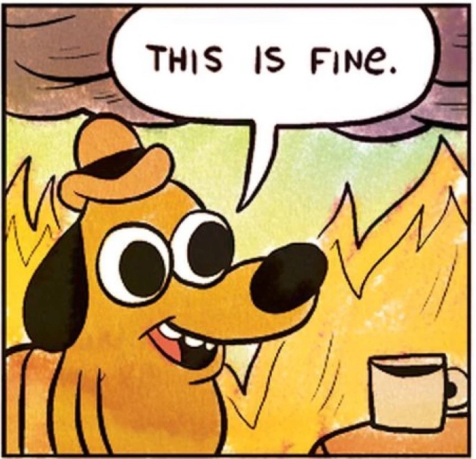

We are experiencing our [second heatwave of the summer here in the UK](https://www.bbc.co.uk/news/articles/cyv0znm6y2eo) and to be honest, I'm sick of it.

Our new home, despite being a recent new build house, seems to get much hotter than the external-wall-insulated house we used to have in Manchester.

We have had to install fans in most rooms, and 2 (!) portable aircon units in the south facing upper rooms to attempt to deal with the heat.

Even with all of this, it still requires frequent cold baths and makes both of us quite grumpy and very lethargic.

I suppose none of this would matter if I wasn't under immense pressure at the moment to study three courses at the same time.

I know that's not an excuse, but it does make me annoyed that no-one really seems to care about climate change.

I have joined [the Green Party](https://en.wikipedia.org/wiki/Green_Party_of_England_and_Wales) and vote Green for over a year now, but I'm really not sure the Green Party will ever get into power, even in a coalition government.

Which, as a scientific-minded sort of person, is intensely annoying [because there is a clear problem to be solved here](https://science.nasa.gov/climate-change/) and a clear solution.

