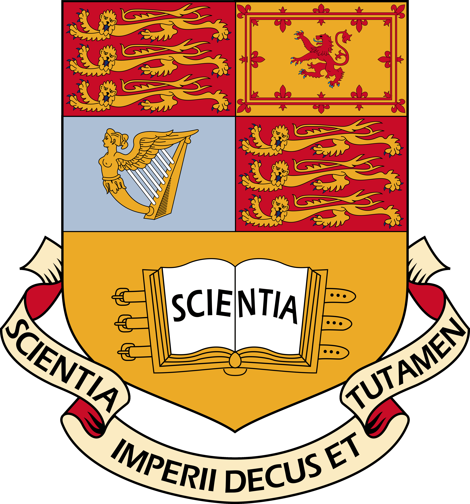

I have signed up for a 7 month professional certificate in Artificial Intelligence and Machine Learning at Imperial College London!

I never thought I'd get the opportunity to study at the University of London in any capacity, but now I'm studying at two UOL colleges at the same time! (even though Imperial is technically independent from the UOL college network nowadays).

So I will be balancing my Cyber Security MSc taught by Royal Holloway, which I'm undertaking in part-time mode, with this part-time course in Artificial Intelligence and Machine Learning at Imperial College London.

This will make the best use of the year-long career break 'study sabbatical' that I have assigned myself and budgeted for. With recent qualifications in Cyber Security and AI/ML from some of the best universities in the world for both subjects, combined with 20 years software engineering experience, I think it will be difficult to argue that my skills are in any way 'out of date' - and will put me in a good position to find work in the intersection of Cyber Security and AI, and/or develop my own products as part of [Straylight Research Ltd](https://straylightresearch.ai).

Of course all this is easier said than done! While I am currently averaging a distinction in my Cyber Security masters degree, I need to maintain this average in addition to taking on the extra work of this Imperial College qualification.

In addition, I'm also studying for the Offsec OSCP+ certification over the next year - although I aim to get the majority of the Imperial course out of the way before I dedicated sufficient time to the OSCP, simply because I will be very busy until then!

Also any significant activity in developing my business, [Straylight Research Ltd](https://straylightresearch.ai) will be put on hold until I am in a position to commit more time to it.

