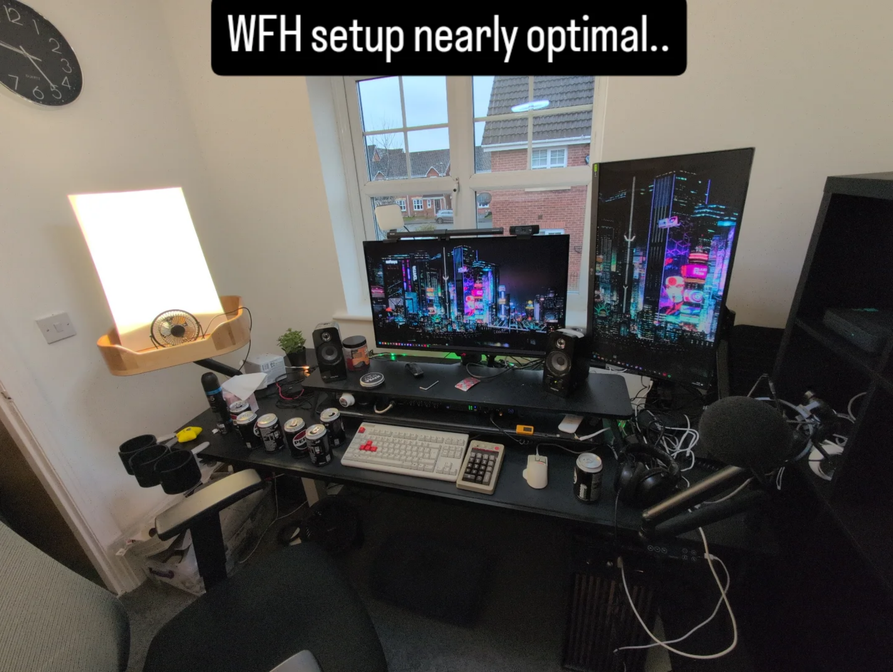

So, what have I been doing lately?

* I have been studying my Imperial College Machine Learning Profesisonal Certificate, and that has been totally kicking my arse, as it is hardcore maths, and I am but a simple man.
* I have been studying the Applied Crytography module for my Masters degree at Royal Holloway, University of London. I have submitted the exam, but I don't feel confident that I'm not going to have to resit it. "So it goes".
* I have been building up the new setup, both the WFH/study from home workstation and the homelab/home network at the new place that we moved into on the 1st December. It is NEARLY there, and when it is "finished" I will share photos so you can see the work I've done. It honestly has been a huge amount of work, but it should result in a setup that pays off over the years I hope to be in this home.
* We have been building IKEA furniture and getting things sorted in the new place, while ferrying equipment and books and so on from the storage unit to the new place.
* I have been reading more, as I have a nice reading setup at the new place with a proper armchair, footrest and reading light. You can see the reviews I've put up on [davidcraddockreads.com](https://davidcraddockreads.com)
* We had a low-key xmas and new years eve, just my wife and I and our cat. It was still good.
* I have been leading the Cyber Security Leaders Challenge University of London Worldwide team, and we have got through to the first qualifiers, which is good news. I will be having regular meetings around that while we work up to the competition qualifier.
* I have been out on my bike quite a bit, you can follow my progress recorded onto Strava by my bike computer on the ['my bike' page](https://davidcraddock.net/my-bike/)

